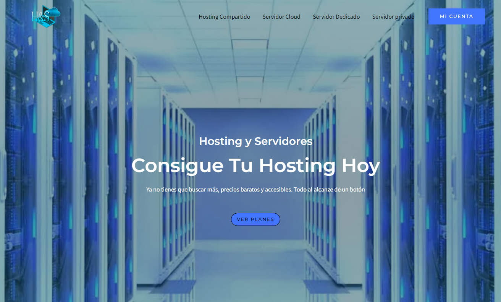
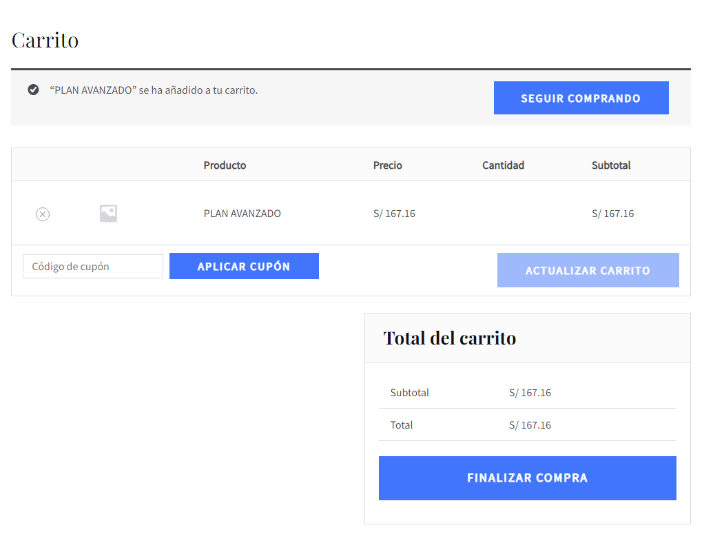
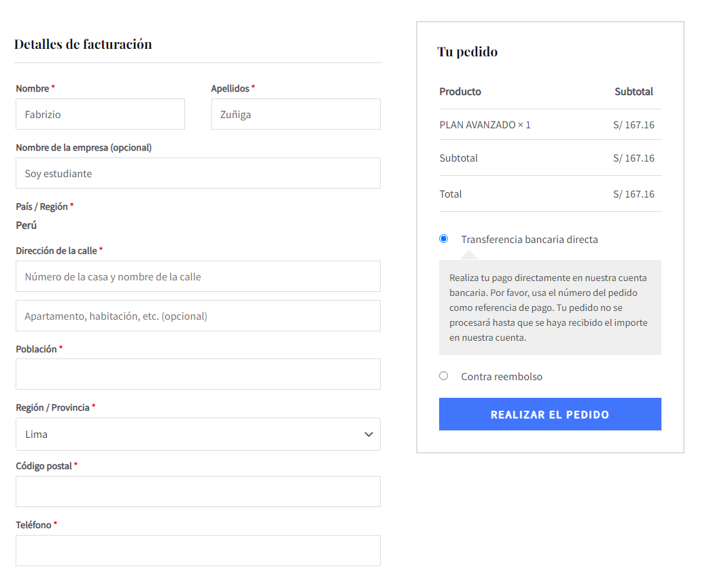

VER: https://hostnation.store/

Descripción del Proyecto:
Este proyecto tiene como objetivo la creación de un sitio web utilizando WordPress y WooCommerce para la venta de servicios de hosting:

1. Instalación de WordPress:

Descargar el archivo ZIP de WordPress desde el sitio web oficial (https://wordpress.org/download/).
Descomprimir el archivo descargado y subir los contenidos al servidor web utilizando un cliente FTP o mediante el panel de control del hosting.
Crear una base de datos MySQL en el servidor web.
Ejecutar el asistente de instalación de WordPress a través del navegador web e ingresar la información requerida, como el nombre de la base de datos, el nombre de usuario y la contraseña.

2. Configuración básica de WordPress:

Acceder al panel de administración de WordPress ingresando la URL del sitio seguida de "/wp-admin".
Configurar los ajustes generales del sitio, como el título, la descripción, el idioma y la zona horaria.

3.Instalación del tema y los plugins:

Buscar y seleccionar un tema de WordPress compatible con WooCommerce y adecuado para el diseño del sitio de venta de hosting.
Instalar y activar el plugin WooCommerce desde el directorio de plugins de WordPress.
Configurar los ajustes básicos de WooCommerce, como la moneda, la ubicación y los métodos de pago.

4.Creación de productos de hosting:

Acceder al panel de administración de WooCommerce y seleccionar la sección de productos.
Crear una categoría de productos para el hosting, por ejemplo, "Hosting".
Crear un producto para cada tipo de hosting (compartido, servidor privado, servidor dedicado y servidor cloud), estableciendo su nombre, descripción, precio y categoría correspondiente.
Configurar las opciones de los productos, como los planes de hosting (plan personal, plan premium y plan avanzado), permitiendo al usuario seleccionar el plan deseado al realizar la compra.

5.Configuración de páginas y menús:

Crear las páginas necesarias para el sitio web, como la página de inicio, la página de productos, la página de carrito de compras, la página de finalización de compra, etc.
Configurar los menús de navegación, agregando enlaces a las páginas creadas y organizándolos según la estructura deseada.

6.Personalización del diseño:

Utilizar el personalizador de WordPress para realizar ajustes visuales en el tema, como el logotipo, los colores, las fuentes y los estilos generales.
Personalizar las páginas y los elementos del sitio utilizando las opciones proporcionadas por el tema seleccionado, como los widgets, las áreas de contenido y las plantillas.

7.Configuración adicional de WooCommerce:

Configurar los ajustes avanzados de WooCommerce, como los impuestos, los métodos de envío, los correos electrónicos de notificación, etc.
Personalizar las plantillas de correo electrónico de WooCommerce para adaptarlas al diseño del sitio y proporcionar información relevante a los clientes.

